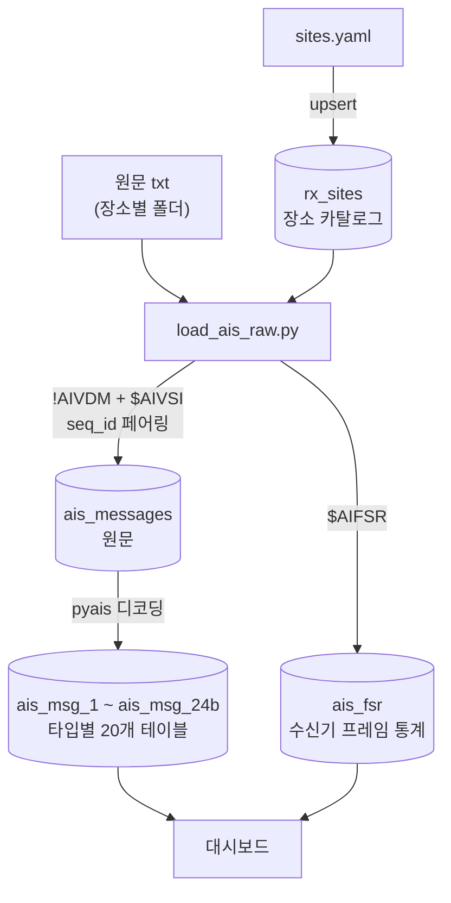

# AIS 데이터 DB 적재 파이프라인

수신기가 남긴 원문 텍스트 파일을 PostgreSQL에 넣고, 분석 가능한 형태까지 가공하는 과정 전체를 정리한다.

명령 하나로 끝난다.

```bash
python db/load_ais_raw.py            # 새로 들어온 파일만 (업데이트)
python db/load_ais_raw.py --rebuild  # 전부 비우고 처음부터 (전체 재적재)
```

---

## 1. 전체 구성

### 파일

| 경로 | 역할 |
|---|---|
| `db/load_ais_raw.py` | **진입점.** 원문 파싱 → 적재 → FSR 추출 → 타입별 파싱까지 전 과정 |
| `db/parse_by_type.py` | AIS 메시지를 타입별 테이블로 디코딩 (pyais 사용) |
| `db/rx_sites.py` | 수집 장소 카탈로그 관리, DB 접속 |
| `AIS_실해역_데이터/sites.yaml` | 장소 정보 원본 (single source of truth) |
| `AIS_실해역_데이터/<장소코드>/*.txt` | 수신기 원문 로그 |

### 데이터 폴더 구조

폴더 이름이 곧 장소 코드다. 이 규칙이 적재 전체를 꿰는 축이다.

```
AIS_실해역_데이터/
├── sites.yaml
├── busan_station/          ← code: busan_station
│   ├── ais_2026-06-09_17.txt
│   └── ... (16개, 시간대별 1파일)
└── kmou/                   ← code: kmou
    ├── ais_2026-06-10_10.txt
    └── ... (6개)
```

### 데이터 흐름



---

## 2. 테이블 구조

### `rx_sites` — 수집 장소 카탈로그

시간 정보가 **없다.** 어느 장소가 어디에 있는지만 기록하는 주소록이다.

| 컬럼 | 타입 | 키 | 설명 |
|---|---|---|---|
| `id` | SMALLSERIAL | **PK** | 다른 테이블이 이 값을 참조한다 |
| `code` | TEXT | UNIQUE | 폴더명과 동일 (`kmou`) |
| `name` | TEXT | | 사람이 읽는 이름 (`국립한국해양대학교 아치캠퍼스`) |
| `lat`, `lon` | DOUBLE PRECISION | | 수신국 좌표 |
| `antenna_h_m` | REAL | | 해수면 기준 안테나 높이. **현재 전부 NULL** (측정값 없음) |
| `note` | TEXT | | 비고 |

`sites.yaml`을 읽어 `ON CONFLICT (code) DO UPDATE`로 갱신한다. 좌표를 정정하려면 yaml만 고치고 다시 실행하면 되고, 메시지 행은 건드리지 않는다.

### `ais_messages` — 원문

원문 1줄(또는 AIVDM+AIVSI 한 쌍)이 1행.

| 컬럼 | 타입 | 키 | 설명 |
|---|---|---|---|
| `id` | BIGSERIAL | **PK** | `ais_msg_*.source_id`가 이 값을 참조 |
| `recv_time` | TIMESTAMP(6) | | 수신 시각 (KST) |
| `msg_type` | SMALLINT | | AIS 메시지 번호 |
| `ais_raw` | TEXT | | AIVDM 원문 (멀티파트는 `\|`로 조립) |
| `vsi_raw` | TEXT | | 짝지은 AIVSI 원문 |
| `site_id` | SMALLINT | **FK → `rx_sites.id`** | 수집 장소. 장소명·코드가 아니라 **정수 id** |
| `src_file` | TEXT | | 출처 파일 (`kmou/ais_2026-06-10_10.txt`) |

제약: `CHECK (ais_raw IS NOT NULL OR vsi_raw IS NOT NULL)`

`site_id`에는 `1`, `2` 같은 정수가 들어간다. 장소 이름을 보려면 조인한다.

```sql
SELECT s.code, s.name, m.recv_time
  FROM ais_messages m JOIN rx_sites s ON s.id = m.site_id;
```

### `ais_fsr` — 수신기 프레임 통계

`$AIFSR` 1줄이 1행. 채널 A/B가 각각 나오므로 **1분에 2행**.

**원문 필드 → 컬럼 매핑.** 쉼표로 자른 뒤의 인덱스 기준이다 (`msg.split("*")[0].split(",")`).

```
$AIFSR , 0 , 085700.00 , A , 556 , 0 , 69 , 572 , 0 , -102 , 707  *3D
  [0]   [1]    [2]     [3]  [4]  [5]  [6]  [7]  [8]  [9]   [10]
```

| 인덱스 | 원문 값 | → 컬럼 | 비고 |
|---|---|---|---|
| `[0]` | `$AIFSR` | — | 문장 식별자 |
| `[1]` | `0` | — | Unique Identifier. **전 구간 `0` 고정이라 저장하지 않음** |
| `[2]` | `085700.00` | `report_time` | `hhmmss.ss` **UTC**. 날짜 없음 → 아래 변환 참고 |
| `[3]` | `A` | `channel` | A / B |
| `[4]` | `556` | `rx_slots` | |
| `[5]` | `0` | `tx_slots` | |
| `[6]` | `69` | `crc_fail` | |
| `[7]` | `572` | `ext_res` | |
| `[8]` | `0` | `own_res` | |
| `[9]` | `-102` | `noise_dbm` | 이전 프레임의 평균 Noise Level. 빈 칸이면 NULL로 저장 |
| `[10]` | `707` | `strong_slots` | 체크섬 `*3D`은 잘라낸 뒤 파싱 |

필드 수가 11개가 아니거나 `[3]`이 A/B가 아니면 그 줄은 버린다. 이때 **적재 로그에 `fsr_bad` 건수로 출력**한다 (DB 컬럼이 아니라 실행 중 집계되는 통계값이며, 조용히 버리지 않기 위한 장치다). 현재 데이터에서는 0건이다.

**테이블 정의**

`프레임` 열이 그 값이 **언제를 설명하는지**를 나타낸다. FSR은 한 문장 안에 이전 프레임 값과 현재 프레임 값이 섞여 있어서 이 구분이 분석의 핵심이다.

| 컬럼 | 타입 | 키 | 출처 | 프레임 | 설명 |
|---|---|---|---|---|---|
| `id` | BIGSERIAL | **PK** | 자동 | — | |
| `site_id` | SMALLINT | **FK → `rx_sites.id`** | 폴더명 | — | 수집 장소. **정수 id** (장소명 아님) |
| `src_file` | TEXT | | 파일 경로 | — | 출처 파일 |
| `recv_time` | TIMESTAMP(6) | | 라인 타임스탬프 | — | 원문 줄 앞의 시각 (KST) |
| `report_time` | TIMESTAMP(6) | UNIQUE¹ | `[2]` + 변환 | — | 문장 생성 시각 (KST) = 현재 프레임 시작점 |
| `frame` | TIMESTAMP(6) | | 생성 컬럼 | — | `report_time − 1분`. **메시지와의 조인 키** |
| `channel` | CHAR(1) | UNIQUE¹ | `[3]` | — | 보고 대상 채널 A / B |
| `rx_slots` | SMALLINT | | `[4]` | **이전** | 정상 수신된 AIS 메시지가 점유한 슬롯 수 (자국 송신 제외) |
| `tx_slots` | SMALLINT | | `[5]` | **이전** | 자국 송신이 점유한 슬롯 수 (수신전용국이라 항상 0) |
| `crc_fail` | SMALLINT | | `[6]` | **이전** | 신호는 검출됐으나 CRC 검증에 실패한 건수 |
| `noise_dbm` | SMALLINT | | `[9]` | **이전** | 평균 Noise Level (dBm, 음수) |
| `strong_slots` | SMALLINT | | `[10]` | **이전** | 평균 Noise Level보다 10dB 이상 강한 신호가 검출된 슬롯 수 |
| `ext_res` | SMALLINT | | `[7]` | **현재** | 외부 무선국의 슬롯 예약 수 (FATDMA 포함, 자국 예약 제외) |
| `own_res` | SMALLINT | | `[8]` | **현재** | 자국이 예약한 슬롯 수 (수신전용국이라 항상 0) |
| `fsr_raw` | TEXT | | 원문 전체 | — | 파싱 오류 시 되짚기용 |

**이전 프레임 = `frame` 값의 1분간**, **현재 프레임 = `report_time` 값의 1분간**이다. 즉 `rx_slots` 등 "이전" 값들을 메시지와 비교하려면 `frame`으로 조인해야 하고, `ext_res`/`own_res`를 쓸 일이 있으면 `report_time`으로 조인해야 한다. 실제로 쓸모 있는 지표가 전부 "이전"이라 조인 키를 `frame`으로 잡았다.

컬럼 순서가 원문 인덱스 순서와 다른 이유도 이것이다. `[7]`,`[8]`만 현재 프레임이라 뒤로 뺐다.

**¹ UNIQUE 제약은 세 컬럼의 조합이다**

```sql
UNIQUE (site_id, channel, report_time)
```

`channel` 하나만으로 UNIQUE인 게 아니다 (그러면 A/B 두 행밖에 못 넣는다). 세 값이 **모두 같은 행이 둘 이상 있으면 거부**한다는 뜻이다.

| site_id | channel | report_time | 허용 |
|---|---|---|---|
| 1 | A | 17:57:00 | ✓ |
| 1 | **B** | 17:57:00 | ✓ 채널이 다름 |
| **2** | A | 17:57:00 | ✓ 장소가 다름 |
| 1 | A | **17:58:00** | ✓ 시각이 다름 |
| 1 | A | 17:57:00 | ✗ **거부** — 완전 중복 |

FSR은 프레임(1분)마다 채널별로 정확히 1건씩 생성되므로 이 조합은 자연키가 된다. 실측 2,294건 전부 이 조합이 고유하다.

**충돌해도 적재는 실패하지 않는다.** INSERT에 `ON CONFLICT ... DO NOTHING`이 걸려 있어 이미 있는 조합은 조용히 건너뛰고, 무시된 건수만 로그에 표시한다.

```
kmou/ais_2026-06-10_11.txt   적재 76,709  ... fsr=114 fsr_중복무시=114
⚠ FSR 중복 114건 무시됨 — 같은 (장소,채널,시각)이 이미 있습니다.
```

**이 제약이 막는 것**은 같은 내용이 두 경로로 들어오는 경우다. 적재 스킵은 `src_file` 문자열 비교라서, 파일명이 다르면 내용이 같아도 다시 들어간다.

- `ais_2026-06-10_11.txt`와 `ais_2026-06-10_11_수정.txt`를 폴더에 함께 둔 경우
- 시간대가 겹치는 파일 (예: 15:00~15:06 버전과 15:00~15:20 버전을 함께 둔 경우)

막지 않으면 이렇게 된다. FSR 행이 2배가 되는 게 아니라 **조인된 메시지 행이 2배로 불어난다.**

| 17:56 채널 A | FSR 1건(정상) | FSR 2건(중복) |
|---|---|---|
| 메시지 행수 | 500 | **1,000** |
| `count(*)` | 500 | **1,000** |
| `sum(vsi_rssi)` | 정상 | **2배** |
| `avg(vsi_rssi)` | 정상 | 정상 (우연히 맞음) |

평균은 멀쩡한데 건수와 합계만 틀려서 화면상으로는 알아채기 어렵다.

**직접 확인하는 쿼리**

```sql
SELECT site_id, channel, report_time, count(*)
  FROM ais_fsr GROUP BY 1,2,3 HAVING count(*) > 1;
```

> **`ais_messages`의 `recv_time` 중복과는 무관하다.** 원문 테이블에는 같은 시각에 수십 건이 들어올 수 있고(초당 28건), 거기엔 UNIQUE 제약이 없다. 이 제약은 `ais_fsr` 테이블에만 걸려 있으며, FSR은 애초에 분당 2건뿐이라 중복이 생길 수 없다.

`ais_messages`를 향한 FK는 **없다** (5절 참고).

**`report_time` 변환 과정** — 원문 `085700.00` → 저장값 `2026-06-09 17:57:00`

1. `[2]`를 UTC 하루 중 초로 환산: `08×3600 + 57×60 + 0.00 = 32220초`
2. KST로 +9시간: `(32220 + 32400) mod 86400 = 64620초` → `17:57:00`
3. 날짜는 라인 타임스탬프(`20260609 17:56:59.6419`)의 날짜를 사용 → `2026-06-09`
4. 라인 시각과 12시간 이상 벌어지면 ±1일 보정 (UTC 자정 = KST 09:00 경계 대응)
5. `frame`은 DB가 자동으로 `17:56:00` 계산

### `ais_msg_*` — 타입별 파싱 결과 (20개)

`pyais`로 디코딩한 전체 필드를 타입별 테이블에 나눠 담는다. 대상은 타입 1, 3, 4, 5, 6, 7, 8, 9, 10, 11, 12, 13, 14, 15, 18, 19, 20, 21 (18종) + Type 24는 필드가 달라 `24a`(Part A) / `24b`(Part B)로 분리 = **20개**.

**공통 컬럼** — VSI 원문에서 나온다.

```
$AIVSI , 0 , 0 , 013323.470135 , 880 , -60 , 47  *76
  [0]  [1] [2]      [3]        [4]   [5]  [6]
```

| 컬럼 | 타입 | 키 | 출처 | 설명 |
|---|---|---|---|---|
| `id` | BIGSERIAL | **PK** | 자동 | |
| `source_id` | BIGINT | **FK → `ais_messages.id`** | 원문 행 | 원문 추적. **장소는 여기를 거쳐 조인** |
| `recv_time` | TIMESTAMP(6) | | 원문 행 | 수신 시각 (KST) |
| `vsi_ui` | SMALLINT | | `[1]` | Unique Identifier |
| `vsi_link` | SMALLINT | | `[2]` | **AIVDM과 짝지을 때 쓴 seq_id** (4절 참고) |
| `vsi_hour` | SMALLINT | | `[3]` 앞 2자 | VSI 정밀 시각, 시 (UTC) |
| `vsi_minute` | SMALLINT | | `[3]` 3~4자 | 분 |
| `vsi_second` | NUMERIC(9,6) | | `[3]` 5자~ | 초 (마이크로초까지) |
| `vsi_slot` | INTEGER | | `[4]` | 점유 슬롯 번호 (0~2249) |
| `vsi_rssi` | SMALLINT | | `[5]` | 신호 세기 |
| `vsi_snr` | SMALLINT | | `[6]` | 신호 대 잡음비 (체크섬 제거 후) |

VSI가 없는 행(VDM 단독)이면 위 VSI 컬럼이 전부 NULL이다.

여기에 타입별 고유 필드가 붙는다. 이 필드들은 `pyais`가 payload를 디코딩한 결과이므로 원문 인덱스 대응이 아니라 **비트 필드 해석 결과**다.

**`ais_msg_*`에는 `site_id`가 없다.** 장소를 알려면 `source_id`로 원문을 거친다.

```sql
SELECT s.code, t.mmsi, t.vsi_rssi
  FROM ais_msg_1 t
  JOIN ais_messages m ON m.id = t.source_id
  JOIN rx_sites    s ON s.id = m.site_id;
``` `radio` 필드는 `sync_state`를 공통 분해하고, SOTDMA 상세(`slot_timeout`, `sub_message`)는 타입 1에서만, ITDMA 상세(`slot_increment`, `num_slots`, `keep_flag`)는 타입 3에서만 분해한다.

---

## 3. 실행 모드

### ① 업데이트 (기본)

```bash
python db/load_ais_raw.py
python db/load_ais_raw.py --site kmou    # 특정 장소만
```

처리 순서:

1. `sites.yaml` 검증 → `rx_sites` upsert
2. 스키마 확인 (구 스키마면 중단하고 `--rebuild` 안내)
3. DB에 이미 있는 `src_file` 목록 조회
4. **아직 없는 파일만** 파싱 → `ais_messages` / `ais_fsr` INSERT
5. **이번에 들어온 파일에서 온 행만** 타입별 파싱

기존 행의 `id`가 바뀌지 않으므로 이미 파싱된 데이터는 그대로 둔다. 93만 행을 다시 디코딩하지 않는다.

### ② 전체 재적재

```bash
python db/load_ais_raw.py --rebuild
```

처리 순서:

1. `sites.yaml` 검증 → `rx_sites` upsert
2. `ais_msg_*` 20개 **DROP** (FK 제거)
3. `ais_messages` TRUNCATE, `ais_fsr` TRUNCATE
4. 필요 시 스키마 갱신 (`site_id` / `src_file` 열 추가)
5. `ais_msg_*` 재생성
6. 전체 파일 적재
7. **전량 재파싱**

스키마가 바뀌었을 때 쓴다. TRUNCATE가 아니라 DROP으로 시작하는 이유는 타입 테이블 정의가 바뀌어도 그대로 반영되고, FK를 먼저 걷어내야 원문을 비울 수 있기 때문이다.

### 보조 플래그

| 플래그 | 설명 |
|---|---|
| `--site <코드>` | 업데이트 모드에서 특정 장소만 (`--rebuild`와 병용 불가) |
| `--no-parse` | 적재만 하고 타입별 파싱은 건너뜀 |

---

## 4. 원문 포맷과 파싱 규칙

### 파일 형식

탭으로 구분된 `타임스탬프 \t NMEA문장` 형태.

```
20260610 11:00:02.0030	!AIVDM,1,1,,A,13aEOK?P00PD2wVMdLDRhgvL289?,0*26
20260610 11:00:02.0035	$AIVSI,0,0,020002.003514,1234,-95,32*7E
20260609 17:56:59.6419	$AIFSR,0,085700.00,A,556,0,69,572,0,-102,707*3D
```

저장 대상은 `!AIVDM`, `$AIVSI`, `$AIFSR` 세 가지. `$PSTT`, `$AIALR`, `$AIADS`는 무시한다.

실측 분포 (전체 2,083,593줄, 2026-06-09 17:56:42 ~ 06-10 15:19:59):

| 프리픽스 | 줄 수 | 처리 |
|---|---|---|
| `!AIVDM` | 1,047,197 | `ais_messages.ais_raw` (멀티파트 조립 후 **1,010,635건**) |
| `$AIVSI` | 1,010,635 | `ais_messages.vsi_raw` |
| `$PSTT` | 21,183 | 무시 |
| `$AIFSR` | 2,294 | `ais_fsr` |
| `$AIADS` | 1,142 | 무시 |
| `$AIALR` | 1,141 | 무시 |
| `$AITXT` | 1 | 무시 |

### AIVDM ↔ AIVSI 페어링

수신기는 메시지 하나마다 AIVDM(내용)과 AIVSI(수신 품질) **두 줄**을 남긴다. 이 둘을 다시 묶어야 "이 메시지의 RSSI"를 알 수 있다.

#### seq_id란

AIVDM 4번째 필드(`[3]`), AIVSI 3번째 필드(`[2]`)에 들어 있는 값이다.

```
!AIVDM , 1 , 1 , 3 , B , 36Sf4MPP@Ta>qd`D5PSri9eD21q0 , 0 *52
   [0]  [1] [2] [3] [4]              [5]
        총   현   seq  채널
        파트 파트
$AIVSI , 0 , 3 , 013323.470135 , 880 , -60 , 47 *76
  [0]  [1] [2]
          seq
```

**값은 `0`~`9` 10개뿐이고 순환한다.** 표준 AIS에서는 단일 파트 메시지의 이 필드를 비워두는 경우가 많지만, **이 수신기는 단일 파트에도 항상 번호를 매긴다.** 실측 분포가 10개 값에 균등하다.

| seq | 0 | 1 | 2 | 3 | 4 | 5 | 6 | 7 | 8 | 9 |
|---|---|---|---|---|---|---|---|---|---|---|
| VDM | 104,742 | 104,759 | 104,681 | 104,735 | 104,691 | 104,733 | 104,743 | 104,645 | 104,668 | 104,800 |
| VSI | 101,063 | 101,063 | 101,063 | 101,064 | 101,064 | 101,064 | 101,064 | 101,063 | 101,063 | 101,064 |

*(전체 22개 파일)*

#### 왜 타임스탬프로 묶지 않는가

- 파일에 따라 `AIVDM → AIVSI` 순서도, `AIVSI → AIVDM` 역순도 있다
- 멀티파트는 `part1 → AIVSI → part2`처럼 VSI가 파트 사이에 끼기도 한다
- 이 경우 두 파트의 타임스탬프가 서로 달라 타임스탬프 매칭이 깨진다

#### 매칭 방식 — seq별 FIFO 큐

seq 값마다 대기열을 하나씩 두고, 먼저 온 쪽을 넣어뒀다가 반대쪽이 오면 앞에서부터 꺼내 짝짓는다.

```
seq=3 VDM 도착 → seq=3 VSI 대기열 비었음 → VDM 대기열에 넣음
seq=3 VSI 도착 → seq=3 VDM 대기열에 있음 → 꺼내서 짝지음 ✓
```

멀티파트는 마지막 파트가 도착해 조립이 끝난 시점에 한 건으로 취급하고, `|`로 이어 붙여 한 행에 저장한다. 짝을 못 찾은 잔여분(VDM만, VSI만)도 버리지 않고 저장한다.

#### 위험 분석 — seq가 10개뿐인데 안전한가

**우려**: 초당 약 28건이 들어오므로 같은 seq 값이 **약 0.36초마다 재사용**된다. 만약 VSI 한 건이 유실되면 그 seq의 큐가 한 칸씩 밀려, 이후 모든 메시지가 **직전 메시지의 VSI와 짝지어지는** 연쇄 오류가 생긴다. 개수는 맞으므로 집계로는 발견되지 않는다.

**검증**: 짝지어진 모든 쌍에 대해 두 줄의 라인 타임스탬프 차이를 측정했다. 올바르게 묶였다면 두 줄이 연속으로 찍히므로 차이가 극히 작아야 하고, 한 칸 밀렸다면 0.36초 이상 벌어진다.

| 항목 | 결과 |
|---|---|
| 총 페어 | **1,010,635건** |
| 짝 없는 VDM / VSI | **0건 / 0건** |
| 미완성 멀티파트 | **0건** |
| 시각 차이 중앙값 | 0.0000초 |
| 시각 차이 p99.9 | 0.0000초 |
| **시각 차이 최댓값** | **0.0007초** |
| 0.36초(seq 1주기) 초과 | **0건** |

**결론: 이 데이터셋에서는 오류가 없다.** 최댓값 0.7ms는 seq 재사용 주기의 1/500에 불과해, 한 칸이라도 밀린 페어가 있었다면 반드시 드러났을 값이다. 짝 없는 VDM/VSI가 0건이라는 것도 큐가 한 번도 어긋나지 않았다는 뜻이다.

**남는 위험과 방어**: 원리적으로는 VSI 유실 시 연쇄 오류가 가능하다. 다만 그 경우 반드시 `vdm_only` 또는 `vsi_only`가 발생하므로, 적재 로그에 파일별로 이 값을 출력해 감시한다. 0이 아니면 그 파일 이후의 페어링을 의심해야 한다.

파일 경계도 이론상 위험 지점이다(파일 A 끝의 VDM, 파일 B 처음의 VSI). 파싱이 파일 단위라 이 경우 짝을 잃는데, 실측 0건이므로 수신기가 두 줄을 항상 함께 기록하는 것으로 보인다.

### FSR 시각 처리

FSR에는 **날짜가 없고** `hhmmss.ss`(UTC)만 있다. 두 단계 보정이 필요하다.

1. **날짜 복원** — 라인 타임스탬프(KST)에서 날짜를 가져온다. 단 UTC 자정(= KST 09:00)을 넘는 순간 하루가 어긋나므로, 12시간 이상 벌어지면 ±1일 보정한다.
2. **프레임 보정** — 문장은 프레임이 *시작될 때* 조립되고, 주요 값들은 *직전* 프레임을 설명한다. 그래서 `frame = report_time − 1분`이 실제로 그 값들이 가리키는 구간이다.

필드별로 가리키는 프레임이 다르다는 점이 중요하다.

| 프레임 | 필드 |
|---|---|
| **이전** (`frame`) | `rx_slots`, `tx_slots`, `crc_fail`, `noise_dbm`, `strong_slots` |
| 현재 (`report_time`) | `ext_res`, `own_res` |

쓸모 있는 지표가 전부 "이전 프레임" 쪽이므로, 메시지와의 조인은 항상 `frame`으로 한다.

```sql
LEFT JOIN ais_fsr f
       ON f.site_id = m.site_id
      AND f.channel = m.channel
      AND f.frame   = date_trunc('minute', m.vsi_time)
```

`LEFT` JOIN이어야 한다. FSR 커버리지가 장소별로 크게 다르다 (아래 참고).

---

## 5. 설계 결정과 이유

### `site_id`는 원문 테이블에만 두고, 타입별 테이블에는 두지 않는다

혼동하기 쉬운 지점이라 정리한다. `site_id`가 들어가는 곳과 안 들어가는 곳이 나뉜다.

| 테이블 | `site_id` | 이유 |
|---|---|---|
| `ais_messages` | **있음** | 수집 장소는 "이 줄을 언제 어디서 받았는가"라는 **원문의 속성** |
| `ais_fsr` | **있음** | 같은 이유 (원문 한 줄 = 한 행) |
| `ais_msg_*` (20개) | **없음** | 원문에서 재생성되는 **파생물**. `source_id`로 조인해서 가져온다 |

"조인으로 한다"는 건 **타입별 테이블 → 원문** 방향을 말한 것이고, 원문 테이블 자체에는 처음부터 열이 필요했다. 어딘가 한 곳에는 저장되어 있어야 조인할 대상이 생긴다.

타입별 테이블에 복사하지 않는 이유:

- 사본이 20벌 생긴다. "이 파일 실은 다른 장소였다"고 정정할 때 20개 테이블을 전부 동기화해야 한다
- 조인 비용이 사실상 0이다. 대시보드 메인 쿼리는 `channel`을 뽑으려고 **이미 `ais_messages`를 조인하고 있다.** `m.site_id`를 SELECT 목록에 한 단어 추가하면 끝이다
- `source_id` → PK 조인이라 99만 행에서도 부담이 없다

### `src_file`을 두는 이유

출처 파일 경로(`kmou/ais_2026-06-10_10.txt`)를 모든 행에 기록한다. 세 가지 역할을 한다.

**① 재실행 안전성(멱등성).** 적재 단위가 파일 하나이고, DB에 이미 있는 `src_file` 목록과 대조해 안 들어간 파일만 넣는다. 이 열이 없으면 "어디까지 넣었는지"를 알 방법이 없어 매번 전체를 다시 넣거나 중복을 감수해야 한다. 기존 노트북이 `DROP TABLE` 후 전체 재적재만 지원했던 이유가 이것이다.

**② 파싱 범위 지정.** 업데이트 모드에서 `WHERE src_file = ANY(...)`로 **이번에 들어온 행만** 파싱한다. 99만 행을 매번 다시 디코딩하지 않는다.

**③ 출처 추적.** 이상한 값이 보일 때 어느 파일에서 왔는지 즉시 알 수 있다. 원문 txt를 열어 해당 줄을 직접 확인할 수 있다.

### 시작/종료 시각을 저장하지 않는다

`rx_sites`에 기간 컬럼이 없다. 데이터에서 유도하는 편이 항상 정확하기 때문이다.

```sql
SELECT s.code, min(m.recv_time), max(m.recv_time), count(*)
  FROM ais_messages m JOIN rx_sites s ON s.id = m.site_id
 GROUP BY s.code;
```

### 갭으로 장소를 추론하지 않는다

무수신 구간이 있다고 장소가 바뀐 게 아니다. 실측상 같은 장소 안에서도 2분 25초짜리 중단이 있었다. 장소는 사람이 적재 시점에 선언하는 ground truth이고, 갭은 별개의 개념(수집 중단)으로 다룬다.

### 적재와 파싱을 한 명령·한 트랜잭션에 묶는다

`ais_msg_*`가 `ais_messages(id)`를 FK로 참조하므로, 원문을 다시 넣으면 `id`가 새로 발급되어 재파싱이 강제된다. 이게 별도 노트북으로 갈라져 있으면 한쪽만 돌린 채 분석에 들어가는 사고가 난다.

### FSR을 원문 테이블에 섞지 않는다

FSR은 선박 메시지가 아니라 수신기 자신의 상태 보고다. `ais_messages`에 넣으면 `CHECK` 제약에 걸리고, "총 메시지 수" 류의 집계가 전부 오염된다.

### FSR에서 원문으로 향하는 FK를 만들지 않는다

FSR은 프레임 전체(2,250슬롯)의 집계라 특정 메시지를 가리키지 않는다. 관계는 1:1이 아니라 `FSR 1행 : 메시지 수백 행`이고, 연결 키는 `(site_id, channel, frame)`이라는 자연키다.

---

## 6. 안전장치

| 상황 | 동작 |
|---|---|
| `sites.yaml`에 없는 폴더가 있음 | 적재 거부 (그 장소가 통째로 누락되는 사고 방지) |
| yaml에 선언된 폴더가 없음 | 적재 거부 |
| `code` 중복 | 적재 거부 |
| 구 스키마에서 업데이트 시도 | 중단 + `--rebuild` 안내 (중복 적재 방지) |
| `--rebuild`와 `--site` 병용 | 인자 오류 |
| FSR 형식 이상 | `fsr_bad`로 카운트해 출력 (조용히 버리지 않음) |
| 중간 실패 | **전체 롤백.** DB는 실행 전 상태 그대로 |

전 과정이 하나의 트랜잭션이라 어디서 실패하든 부분 적용된 상태가 남지 않는다.

---

## 7. 새 데이터 추가 절차

1. `AIS_실해역_데이터/<새장소코드>/` 폴더를 만들고 원문 txt를 넣는다
2. `sites.yaml`에 항목을 추가한다

   ```yaml
   - code: new_site          # 폴더명과 동일해야 함
     name: 새 수집지 이름
     lat: 35.0000000
     lon: 129.0000000
     antenna_h_m: null
     note: 수집 메모
   ```

3. `python db/load_ais_raw.py` 실행

**운영 규칙: 파일 하나는 반드시 한 장소.** 장소를 옮길 땐 수신 프로그램을 껐다 켠다. 물리적으로 자연스러운 동작이라 지키기 어렵지 않다.

---

## 8. 실행 결과 확인

정상 종료 시 아래가 출력된다.

```
장소별 현황 (수집 시작/종료 시각은 여기서 유도된다)
  busan_station   부산역 인근 호텔        ...행 / 파일 16개   2026-06-09 17:56:42 ~ 2026-06-10 08:30:14
  kmou            국립한국해양대학교...   ...행 / 파일  6개   2026-06-10 10:33:23 ~ 2026-06-10 15:06:28

FSR 현황 (분당 채널별 1건)
  busan_station    1,746행 /   873분   ...   평균잡음 ... dBm
  kmou                34행 /    17분   ...

타입별 파싱: ...행 / 원문 디코딩 대상 ...행  ✓ 일치
  type 1=..., type 3=..., type 5=...
```

확인 포인트 (원문 재집계로 미리 계산해둔 기댓값):

| 항목 | 기댓값 |
|---|---|
| 파일 수 | 22개 (`busan_station` 16 + `kmou` 6) |
| `ais_messages` 행 수 | **1,010,635** |
| `ais_fsr` 행 수 | **2,294** (`busan_station` 1,746 + `kmou` 548, `fsr_이상` 표시 없어야 함) |
| `vdm_only` / `vsi_only` / `incomplete` | 전부 **0** (페어링 건전성 지표) |
| 타입별 파싱 | **✓ 일치** (불일치면 디코딩 실패분 확인) |

---

## 9. 알려진 제약

### FSR 결측 구간이 조금 있다

| 장소 | FSR 분 | 구간 | 결측 |
|---|---|---|---|
| `busan_station` | 873분 | 874분 (17:57 ~ 08:30) | 1분 |
| `kmou` | 274분 | 287분 (10:34 ~ 15:20) | 13분 |

결측 구간은 세 곳뿐이다 — `06-09 18:13`(2분), `06-10 10:50`(12분), `06-10 11:21`(3분). 모두 아래 "수집 중단"과 같은 시각이라, FSR이 따로 빠진 게 아니라 수신 자체가 멈춘 구간이다.

커버리지는 양호하지만 **조인은 여전히 LEFT JOIN이어야 한다.** 결측 분의 메시지는 FSR 없이 남는다.

### UTC 자정 처리가 미검증 경로다

FSR 날짜 복원에서 UTC 자정(= KST 09:00)을 넘는 케이스는 코드로 방어했지만, 현재 데이터에서는 그 시각이 마침 장소 이동 갭(08:30~10:33) 안에 들어가 **실제로 실행된 적이 없다.** 다음 수집 데이터에서 확인이 필요하다.

### 수집 중단 구간이 보고주기 분석을 오염시킨다

전 선박 무수신 구간이 실측 6건 있다 (5초 이상 기준).

| 시각 | 길이 |
|---|---|
| 06-09 18:13:37 | 34초 |
| **06-10 08:30:14** | **7,389초 (123분) — 장소 이동** |
| 06-10 10:50:42 | 95초 |
| 06-10 10:59:59 | 105초 |
| 06-10 11:21:20 | 145초 |
| 06-10 14:57:23 | 7초 |

장소 이동을 뺀 최대 중단은 145초다. 이 값은 세션 구분 임계(30분)를 정할 때의 근거이기도 하다.

이 구간을 걸친 보고 간격은 선박 잘못이 아니라 수신 중단인데, 현재 분석 로직은 이를 구분하지 못해 위반으로 오탐한다. 별도 과제로 남아 있다.

### 노트북과 중복

`ais_to_db.ipynb`, `ais_parse_by_type.ipynb`는 이 스크립트로 대체되었다. 로직이 갈라지면 혼란이 생기므로 정리가 필요하다.

---

## 10. SQL 쿼리 모음

파일별로 어떤 쿼리를 쓰는지 정리한다.

### `db/rx_sites.py`

**DDL — 장소 카탈로그**

```sql
CREATE TABLE IF NOT EXISTS rx_sites (
    id          SMALLSERIAL PRIMARY KEY,
    code        TEXT UNIQUE NOT NULL,      -- 폴더명과 동일
    name        TEXT NOT NULL,
    lat         DOUBLE PRECISION NOT NULL,
    lon         DOUBLE PRECISION NOT NULL,
    antenna_h_m REAL,
    note        TEXT
);
```

**UPSERT — `sites.yaml` 반영.** 항목마다 1회씩 실행한다.

```sql
INSERT INTO rx_sites (code, name, lat, lon, antenna_h_m, note)
VALUES (%(code)s, %(name)s, %(lat)s, %(lon)s, %(antenna_h_m)s, %(note)s)
ON CONFLICT (code) DO UPDATE
   SET name = EXCLUDED.name, lat = EXCLUDED.lat, lon = EXCLUDED.lon,
       antenna_h_m = EXCLUDED.antenna_h_m, note = EXCLUDED.note;
```

`code`가 처음 보는 값이면 INSERT, 이미 있으면 나머지 필드를 UPDATE한다. yaml을 고치고 다시 실행하면 좌표만 갱신되고 `id`는 유지되므로 `ais_messages.site_id`가 깨지지 않는다.

**조회 — code → id 매핑**

```sql
SELECT code, id FROM rx_sites;
```

### `db/load_ais_raw.py`

**DDL — 원문 테이블**

```sql
CREATE TABLE IF NOT EXISTS ais_messages (
    id        BIGSERIAL PRIMARY KEY,
    recv_time TIMESTAMP(6),
    msg_type  SMALLINT,
    ais_raw   TEXT,
    vsi_raw   TEXT,
    site_id   SMALLINT NOT NULL REFERENCES rx_sites(id),
    src_file  TEXT NOT NULL,
    CONSTRAINT chk_not_both_null CHECK (ais_raw IS NOT NULL OR vsi_raw IS NOT NULL)
);
CREATE INDEX IF NOT EXISTS idx_ais_messages_recv_time ON ais_messages (recv_time);
CREATE INDEX IF NOT EXISTS idx_ais_messages_msg_type  ON ais_messages (msg_type);
CREATE INDEX IF NOT EXISTS idx_ais_messages_site_time ON ais_messages (site_id, recv_time);
CREATE INDEX IF NOT EXISTS idx_ais_messages_src_file  ON ais_messages (src_file);
```

**DDL — FSR 테이블**

```sql
CREATE TABLE IF NOT EXISTS ais_fsr (
    id           BIGSERIAL PRIMARY KEY,
    site_id      SMALLINT NOT NULL REFERENCES rx_sites(id),
    src_file     TEXT NOT NULL,
    recv_time    TIMESTAMP(6) NOT NULL,
    report_time  TIMESTAMP(6) NOT NULL,
    frame        TIMESTAMP(6) GENERATED ALWAYS AS
                     (report_time - interval '1 minute') STORED,
    channel      CHAR(1) NOT NULL,
    rx_slots     SMALLINT,
    tx_slots     SMALLINT,
    crc_fail     SMALLINT,
    noise_dbm    SMALLINT,
    strong_slots SMALLINT,
    ext_res      SMALLINT,
    own_res      SMALLINT,
    fsr_raw      TEXT NOT NULL,
    UNIQUE (site_id, channel, report_time)
);
CREATE INDEX IF NOT EXISTS idx_ais_fsr_join ON ais_fsr (site_id, channel, frame);
```

**INSERT — 원문.** `psycopg2.extras.execute_values`로 파일당 1회, 10,000행씩 묶어 보낸다.

```sql
INSERT INTO ais_messages
       (recv_time, msg_type, ais_raw, vsi_raw, site_id, src_file)
VALUES %s;
```

**INSERT — FSR.** 5,000행씩.

```sql
INSERT INTO ais_fsr
       (site_id, src_file, recv_time, report_time, channel,
        rx_slots, tx_slots, crc_fail, ext_res, own_res,
        noise_dbm, strong_slots, fsr_raw)
VALUES %s
ON CONFLICT (site_id, channel, report_time) DO NOTHING;
```

`frame`은 생성 컬럼이라 INSERT 목록에 넣지 않는다. DB가 계산한다. `DO NOTHING`이라 중복이 와도 적재가 실패하지 않고, 무시된 건수는 `len(fsr) - cur.rowcount`로 세어 로그에 표시한다.

**적재 여부 판정 — 어느 파일까지 들어갔는지**

```sql
SELECT DISTINCT src_file FROM ais_messages;
```

이 목록에 없는 파일만 새로 넣는다. `ON CONFLICT`나 `DELETE` 없이 멱등성을 얻는 방식이다.

**스키마 점검**

```sql
-- 테이블 존재 여부
SELECT to_regclass('ais_messages');

-- 구 스키마 판별 (site_id / src_file 열이 있는지)
SELECT column_name FROM information_schema.columns WHERE table_name = 'ais_messages';

-- 미분류 행 검사
SELECT count(*) FROM ais_messages WHERE src_file IS NULL;

-- ais_messages 를 참조하는 테이블 목록 (TRUNCATE 전 확인용)
SELECT DISTINCT c.conrelid::regclass::text
  FROM pg_constraint c
 WHERE c.contype = 'f' AND c.confrelid = 'ais_messages'::regclass;
```

**구 스키마 업그레이드** (`--rebuild` 시 빈 테이블에만 적용)

```sql
ALTER TABLE ais_messages ADD COLUMN IF NOT EXISTS site_id  SMALLINT REFERENCES rx_sites(id);
ALTER TABLE ais_messages ADD COLUMN IF NOT EXISTS src_file TEXT;
ALTER TABLE ais_messages ALTER COLUMN site_id  SET NOT NULL;
ALTER TABLE ais_messages ALTER COLUMN src_file SET NOT NULL;
```

**전체 재적재 시 비우기**

```sql
DROP TABLE IF EXISTS ais_msg_1;   -- ... 20개 전부. FK 를 먼저 걷어낸다
TRUNCATE ais_messages CASCADE;
TRUNCATE ais_fsr;                 -- ais_messages 를 참조하지 않아 CASCADE 로 안 비워짐
```

**결과 요약 — 장소별 현황.** 수집 시작/종료 시각을 데이터에서 유도하는 쿼리다.

```sql
SELECT s.code, s.name, count(*), count(DISTINCT m.src_file),
       min(m.recv_time), max(m.recv_time)
  FROM ais_messages m JOIN rx_sites s ON s.id = m.site_id
 GROUP BY s.code, s.name
 ORDER BY 5;
```

**결과 요약 — FSR 현황**

```sql
SELECT s.code, count(*), count(DISTINCT f.frame),
       min(f.frame), max(f.frame), round(avg(f.noise_dbm), 1)
  FROM ais_fsr f JOIN rx_sites s ON s.id = f.site_id
 GROUP BY s.code
 ORDER BY 4;
```

**결과 요약 — 파싱 정합성 검증**

```sql
-- 타입별 테이블 20개 행수 합계
SELECT t, n FROM (
  SELECT 'ais_msg_1' t, count(*) n FROM ais_msg_1
  UNION ALL SELECT 'ais_msg_3', count(*) FROM ais_msg_3
  -- ... 20개
) x WHERE n > 0 ORDER BY n DESC;

-- 원문의 디코딩 대상 행수 (위 합계와 같아야 정상)
SELECT count(*) FROM ais_messages WHERE ais_raw IS NOT NULL;
```

### `db/parse_by_type.py`

**DDL — 타입별 테이블 20개.** `TYPE_SCHEMAS` 정의로부터 생성한다.

```sql
CREATE TABLE IF NOT EXISTS ais_msg_1 (
    id BIGSERIAL PRIMARY KEY,
    source_id BIGINT, recv_time TIMESTAMP(6),
    vsi_ui SMALLINT, vsi_link SMALLINT,
    vsi_hour SMALLINT, vsi_minute SMALLINT, vsi_second NUMERIC(9,6),
    vsi_slot INTEGER, vsi_rssi SMALLINT, vsi_snr SMALLINT,
    -- ↓ 타입별 고유 필드 (type 1 의 경우)
    repeat SMALLINT, mmsi INTEGER, status SMALLINT, turn REAL, speed REAL,
    accuracy BOOLEAN, lon DOUBLE PRECISION, lat DOUBLE PRECISION,
    course REAL, heading SMALLINT, second SMALLINT, maneuver SMALLINT,
    raim BOOLEAN, radio INTEGER,
    sync_state SMALLINT, slot_timeout SMALLINT, sub_message INTEGER,
    FOREIGN KEY (source_id) REFERENCES ais_messages(id)
);
CREATE INDEX IF NOT EXISTS idx_ais_msg_1_recv_time ON ais_msg_1 (recv_time);
CREATE INDEX IF NOT EXISTS idx_ais_msg_1_mmsi      ON ais_msg_1 (mmsi);
```

앞의 10개 공통 컬럼은 모든 테이블이 동일하고, 그 뒤 필드만 타입별로 다르다.

**DROP** (`--rebuild` 시)

```sql
DROP TABLE IF EXISTS ais_msg_1;   -- 20개 전부
```

**읽기 — 서버사이드 커서로 스트리밍.** 100만 행을 메모리에 한 번에 올리지 않기 위해 이름 있는 커서를 쓰고 `itersize = 20000`으로 나눠 받는다.

```sql
-- 전체 재파싱 (--rebuild)
SELECT id, recv_time, ais_raw, vsi_raw
  FROM ais_messages
 WHERE ais_raw IS NOT NULL
 ORDER BY id;

-- 증분 파싱 (업데이트 모드) — 이번에 들어온 파일만
SELECT id, recv_time, ais_raw, vsi_raw
  FROM ais_messages
 WHERE ais_raw IS NOT NULL AND src_file = ANY(%s)
 ORDER BY id;
```

**INSERT — 타입별.** 버퍼가 5,000행 차면 해당 테이블로 flush한다.

```sql
INSERT INTO ais_msg_1 (source_id, recv_time, vsi_ui, ..., sub_message) VALUES %s;
```

### 분석용 조인 (참고)

```sql
-- 메시지 + 장소 + FSR
SELECT s.code AS site, t.mmsi, t.vsi_rssi, t.vsi_snr,
       f.noise_dbm, f.crc_fail, f.strong_slots
  FROM ais_msg_1 t
  JOIN ais_messages m ON m.id = t.source_id
  JOIN rx_sites    s ON s.id = m.site_id
  LEFT JOIN ais_fsr f
         ON f.site_id = m.site_id
        AND f.channel = split_part(m.ais_raw, ',', 5)
        AND f.frame   = date_trunc('minute',
              make_timestamp(2026, 6, 10, t.vsi_hour, t.vsi_minute, 0)
              + interval '9 hours');
```

`vsi_time` 계산은 대시보드가 쓰는 방식(`date(recv_time - 9h) + 시분초 + 9h`)을 따르면 된다.

---

## 11. 환경

접속 정보는 환경변수를 먼저 읽고, 없으면 개발용 기본값을 쓴다.

| 환경변수 | 기본값 |
|---|---|
| `AIS_DB_HOST` | `localhost` |
| `AIS_DB_PORT` | `5432` |
| `AIS_DB_USER` | `sim_user` |
| `AIS_DB_NAME` | `ais_analysis_db` |
| `AIS_DB_PASSWORD` | (개발용 기본값) |

의존 패키지: `psycopg2-binary`, `PyYAML`, `pyais`

`ais_fsr.frame`이 생성 컬럼(`GENERATED ALWAYS AS ... STORED`)이라 **PostgreSQL 12 이상**이 필요하다.
